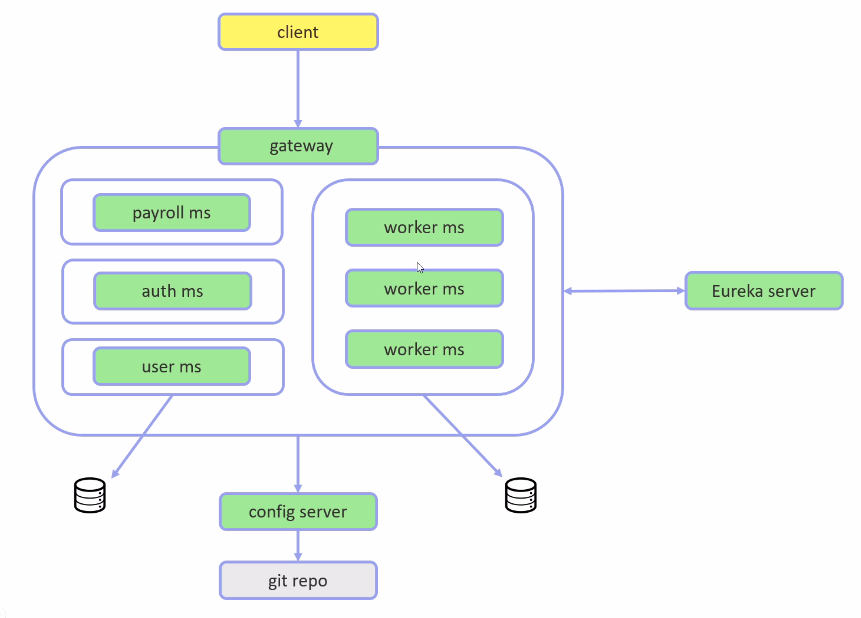

<h1 align="center">
  <a>Arquitetura de Microserviços</a>
</h1>

<p align="center">
  <a href="#-tecnologias">Tecnologias</a>&nbsp;&nbsp;&nbsp;|&nbsp;&nbsp;&nbsp;
  <a href="#-projeto">Projeto</a>&nbsp;&nbsp;&nbsp;|&nbsp;&nbsp;&nbsp;
  <a href="#-ordem-de-execucao">Ordem de execução</a>&nbsp;&nbsp;&nbsp;|&nbsp;
  <a href="#-keycloak-server">Keycloak Server</a>&nbsp;&nbsp;&nbsp;|&nbsp;
</p>


# Tecnologias

Esse projeto foi desenvolvido com as seguintes tecnologias:

- [Spring Authorization Server](https://spring.io/projects/spring-authorization-server)
- [Spring Boot](https://spring.io/projects/spring-boot)
- [Spring Security](https://spring.io/projects/spring-security)
- [Lombok](https://projectlombok.org/)
- [PostgreSQL](https://www.postgresql.org/)
- [Keycloak](https://www.keycloak.org/)
- [Actuator](https://www.keycloak.org/)


## Projeto

Este projeto tem como objetivo aprofundar o estudo da arquitetura de microserviços, explorando a implementação de uma infraestrutura robusta e escalável. Compreender os princípios e práticas dessa abordagem arquitetônica é fundamental para o desenvolvimento de sistemas distribuídos e resilientes, essenciais para empresas que buscam adaptabilidade e agilidade no cenário atual de desenvolvimento de software.

Ao longo deste projeto, serão utilizadas diversas ferramentas amplamente reconhecidas e empregadas em âmbito corporativo. Essas ferramentas são selecionadas com base em sua relevância e aplicabilidade em ambientes de produção de grande escala, contribuindo para uma compreensão abrangente e prática da arquitetura de microserviços.



## Ordem de execução
<ol>
  <li>hr-eureka-server</li>
  <li>hr-config-server</li>
  <li>hr-api-gateway</li>
  <li>Os demais microserviços sem ordem definida</li>
</ol>


## Keycloak Server
```
http://localhost:8081
```


## Swagger 
```
http://localhost:8765/swagger-ui.html
```
